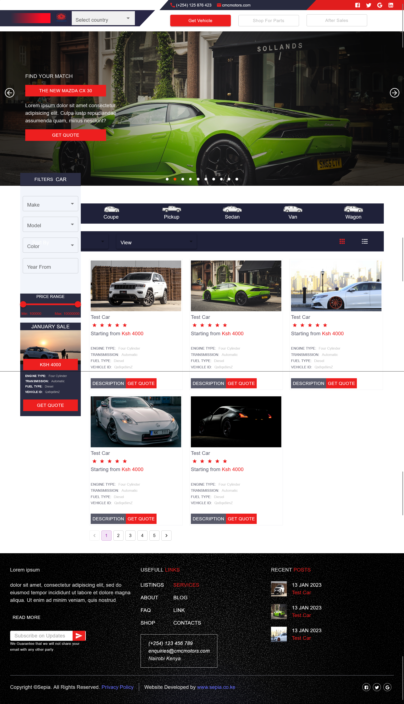

# CMC - Car Dealership Landing Page
CMC is a simple, yet modern landing page for a car dealership built with ReactJS and bootstrapped with Vite. The site utilizes Material UI for a sleek design and easy navigation.

## Features
- Browse through a wide selection of vehicles
- Filter vehicles by make, model, and year
- View detailed information and photos of each vehicle
- Contact the dealership directly through the site for more information or to schedule a test drive

## Live Link
The site has been deployed on [vercel](https://cmc-pi.vercel.app)

## Getting Started
These instructions will get you a copy of the project up and running on your local machine for development and testing purposes.

## Prerequisites
- Node.js
- Vite
- Material UI
## Installing
- Clone the repository
```bash
 git clone https://github.com/hermitex/CMC.git
```
- Install the dependencies
```bash
npm install
```
- Start the development server
```bash
npm run dev
```
Open http://localhost:3000 to view the site in the browser.

## Built With
ReactJS - A JavaScript library for building user interfaces
Vite - A lightweight development server for building single-page apps
Material UI - A UI library for React with a set of components following Google's Material Design guidelines

## Contributing
Please read CONTRIBUTING.md for details on our code of conduct, and the process for submitting pull requests to us.

## Authors
Tiberius Mairura - Initial work - [Your Github](https://github/hermitex)

## License
This project is licensed under the MIT License - see the LICENSE.md file for details

## Acknowledgments
- Material UI for providing the UI components

## Screenshots
Here is the page screenshot.

